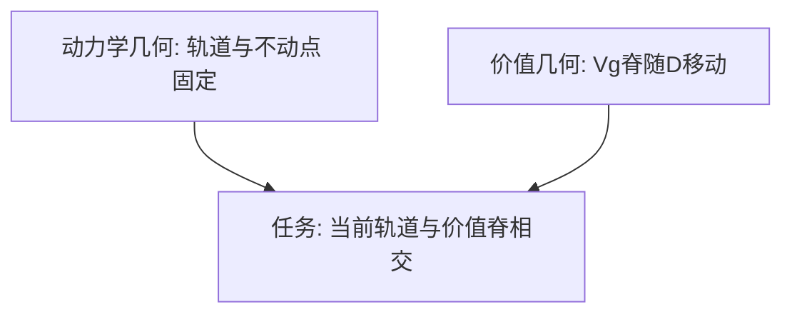

# Cut-to-Box 任务：实验设计

## 摘要

本研究采用 **Cut-to-Box（切绳入箱）** 行为范式，以**目标导向的释放时机**作为探针，考察被试是否持有可用于抛射决策的**内部单摆动力学模型**。单摆以固定振幅摆动；被试在某个时刻按下切断键，摆球脱离摆线作抛射运动，目标为使摆球落入地面上的目标箱。被试的唯一控制维度是**何时切断**——一维决策。该任务具有诊断性：释放态 $(\theta, \omega)$ 经抛射切换映射至着陆点，该映射对释放相位**非单调**（「越晚切断 = 落点越远」在部分区间不成立）；仅追踪屏幕位置的策略无法解题，而表征完整状态与切向发射速度的策略可以。移动箱子会使价值最大化的释放相位在相平面上扫过，从而将**固定的动力学几何**（摆的轨道与不动点）与**目标依赖的价值几何**（何处切断能成功）分离开来。本文档规定刺激、实验条件、行为读数及可区分候选策略的定性签名

---

## 1 研究问题与假设

### 1.1 研究动机

被动预测（「摆球将在何处？」）**欠定**内部模型：多种近似在短时推演上可能一致。而**朝向目标行动**迫使被试作出承诺：必须将所持有的摆模型转化为单一运动决策，且该决策的收益可评分。

Cut-to-Box 是将上述逻辑最简化的任务之一：

- **行动一维**：整个决策是摆动弧线上的一个点（释放时刻）；
- **收益可解析**：切断后飞行为标准抛射，最优释放可计算，误差可解释；
- **映射非单调且目标依赖**：简单启发式会产生**可证伪的、可区分**的错误模式。

### 1.2 核心研究问题

被试选择切断时机时，是依据**内部摆模型**对切断后抛射结果进行**价值评估**，还是采用**忽略发射速度几何**的位置/时间启发式？

## 2 被试

### 2.2 试次量（试点设计）

试点方案交叉约 **6 个箱子距离** × **2 个振幅水平** × **2 个飞行遮挡水平**，每单元胞约 **20** 次重复，合计约 **480** 试次/人（$6 \times 2 \times 2 \times 20 \approx 480$）。

---

## 3 实验装置

### 3.1 硬件环境

- 彩色显示器（呈现摆、箱子及反馈）；
- 输入设备：用于**按住并松开切断键**的响应器（具体键位见 §10 待补充）；
- 建议安静环境，减少非视觉干扰。

### 3.2 任务场景（刺激级描述）

- 长度为 $L$ 的单摆悬挂于高度 $H$ 处的枢轴；
- 摆球以**固定振幅**摆动；
- 地面水平距离 $D$ 处放置目标箱；
- 被试**按住切断键**；松开瞬间切断摆线，摆球沿抛射轨迹运动；
- **飞行遮挡**（主条件）：切断后摆球消失，直至着陆前不可见，迫使决策依赖内部模型而非在线视觉追踪；
- **反馈**：是否落入箱内，以及着陆点位置。

> **说明**：实验程序实现待开发；本节仅规定任务级呈现与操作需求。

---

## 4 刺激与物理模型

### 4.1 坐标与释放态

枢轴位于 $(0, H)$；$\theta$ 自竖直向下量起。切断瞬间摆球沿弧线切向速度 $v = \omega L$，释放态 $(\theta, \omega)$ 确定发射位置与速度：

$$
x_0 = L \sin\theta, \quad y_0 = H - L \cos\theta
$$

$$
v_x = \omega L \cos\theta, \quad v_y = \omega L \sin\theta \tag{1}
$$

### 4.2 抛射与着陆

切断后摆球作抛射运动。取下降至箱子高度 $y_b$ 的 descending root，着陆时刻与水平位置为：

$$
t_\mathrm{land} = \frac{v_y + \sqrt{v_y^2 + 2g(y_0 - y_b)}}{g}
$$

$$
x_\mathrm{land} = x_0 + v_x \, t_\mathrm{land} \tag{2}
$$

### 4.3 为何释放时机具有诊断性

**（1）着陆映射对释放相位非单调**

在固定摆动上（Proposal 7 数值示例：$L = 1\,\mathrm{m}$，$H = 2.2\,\mathrm{m}$，振幅 $85°$），可达着陆距离约为 $-1.0\,\mathrm{m}$ 至 $3.07\,\mathrm{m}$；**最大射程不在摆动最低点**，而在 $\theta \approx 31°$ 附近——上摆段释放时 $v_y > 0$，可延长飞行。因此「越晚切断以投得更远」在部分区间失效；中程箱可由**两个不同释放相位**达到，且对应价值脊宽度不同（其一对时机误差更宽容）。

**（2）同一相平面上的两种几何**

- **动力学几何**（不随目标改变）：中心不动点 $(0, 0)$、鞍点 $(\pm\pi, 0)$、闭合能量轨道与 separatrix；
- **价值几何**（随目标改变）：使摆球落入箱内的释放态集合，即 $V_g(\theta, \omega)$ 的亮脊，随箱子移动而移动。

解题即求**当前轨道**与**当前价值脊**的交点。当 $D$ 从 $0.8\,\mathrm{m}$ 增至 $2.4\,\mathrm{m}$ 时，最优释放相位从 $\theta^\star \approx -28°$ 移至 $\theta^\star \approx +55°$——同一物理态在不同目标下具有不同价值，这正是被试须表征的量。

### 4.4 图示参数（Proposal 7 数值示例，非正式实验锁定值）

| 量            | 示例取值                                                  | 说明                   |
| ------------- | --------------------------------------------------------- | ---------------------- |
| 摆长$L$     | $1\,\mathrm{m}$                                         | 用于 Figure 2 数值计算 |
| 枢轴高度$H$ | $2.2\,\mathrm{m}$                                       | 同上                   |
| 振幅          | $85°$                                                  | 大振幅轨道示例         |
| 最大射程      | $3.07\,\mathrm{m}$（$\theta \approx 31°$）           | 非最低点               |
| 近箱最优释放  | $\theta^\star \approx -28°$（$D = 0.8\,\mathrm{m}$） | Figure 1               |
| 远箱最优释放  | $\theta^\star \approx +55°$（$D = 2.4\,\mathrm{m}$） | Figure 1               |

正式实验参数是否采用上述数值见 §10。

---

## 5 实验设计

### 5.1 设计类型

多因素被试内设计，主要操纵：

| 因素             | 水平                | 说明                                                   |
| ---------------- | ------------------- | ------------------------------------------------------ |
| 箱子距离$D$    | 约 6 档（近 → 远） | 含双解中程箱；预测释放相位的特定、**非单调**偏移 |
| 轨道能量 / 振幅  | 小 vs 大            | 改变可达射程；小振幅下远箱不可达 → reachability 测试  |
| 飞行遮挡         | 可见 vs 完全遮挡    | **完全遮挡为主条件**；迫使依赖内部模型           |
| 重标定块（可选） | 改变$L$ 或 $g$  | 整体缩放映射；检验模型迁移 vs 刺激–反应重学           |

### 5.2 单试次流程

文字描述：

1. **观察**：观看摆动 **1–2 个周期**；
2. **目标线索**：箱子出现（标示距离 $D$）；
3. **切断**：被试在自选时刻松开切断键；
4. **飞行遮挡**：摆球自切断起不可见，直至着陆；
5. **反馈**：呈现是否入箱及着陆点。

### 5.3 可达性与自然扩展（pump-then-release）

当箱子超出**当前轨道**的最大可达射程时，正确行为不是立即切断，而是**先泵摆增大轨道、再释放**（pump-then-release）。该变体将轨道动力学、能量注入、释放切换与目标串联于单一任务；Proposal 7 在此仅作标注，模型化发展见 Proposal 8。是否纳入首版实验见 §10。

---

## 6 因变量与行为读数

### 6.1 主要读数

| 读数                     | 说明                                                                      |
| ------------------------ | ------------------------------------------------------------------------- |
| **释放相位分布**   | 各条件下切断时刻对应的释放相位（$\theta$、$\omega$ 或等价表征）的分布 |
| **有符号着陆误差** | 作为$D$ 的函数，区分过射 vs 欠射                                        |
| **成功率**         | 落入箱内的试次比例                                                        |
| **决策时间**       | 从试次相关起点至切断的时刻（起止定义见 §10）                             |
| **试间变异**       | 在重复出现的相同状态下的试次间变异                                        |
| **声明不可达率**   | 小振幅条件下被试声明目标不可达（或等效行为）的比例                        |

### 6.2 分析单元

以**试次级**记录释放态、着陆结果与条件标签（$D$、振幅、遮挡）；重复试次用于估计条件内分布与变异。具体字段与导出格式见 §10。

---

## 7 预测性行为签名

### 7.1 三策略对比

| 情境                     | 完整内部模型                                               | 「越晚 = 越远」启发式                                                                          | 固定小角模型                     |
| ------------------------ | ---------------------------------------------------------- | ---------------------------------------------------------------------------------------------- | -------------------------------- |
| $D$ 增大（含非单调区） | 释放相位按解析最优**非单调**追踪 $\theta^\star(D)$ | 释放相位**单调**随 $D$ 增大；越过 $\theta \approx 31°$ 射程峰后**系统性过射** | 大振幅下切向速度低估 → 着陆偏短 |
| 双解中程箱               | 偏好**更宽**价值脊（时机更稳健）的释放相位           | 不区分双解，倾向单一单调策略                                                                   | 两解均可能偏短                   |
| 小振幅 + 远$D$         | 可声明不可达或采取 pump-then-release（若任务允许）         | 仍可能按单调启发式切断 → 失败模式可辨                                                         | 误差随振幅增大                   |
| 飞行完全遮挡             | 依赖内部发射几何，表现反映模型质量                         | 主要依赖观察阶段位置/时间线索，遮挡影响相对小                                                  | 遮挡影响介于二者之间             |

### 7.2 操纵的差异化预测

- **降低证据**（缩短观察、降低对比度）：释放分布变宽，向振幅平均猜测收缩；
- **飞行遮挡**：对启发式伤害最小；对完整内部模型最具诊断力（隐藏的发射几何仅模型策略必需）。

---

## 8 试点与验证计划

### 8.1 采样策略

试点先在 $D$ 与释放相位的**粗网格**上采样，定位候选策略分歧最大的区域——**远箱 + 大振幅**角落（非单调性最显著处），再在该区域**加密**采样。

### 8.2 运行前健全性检查（Sanity checks）

正式采集前须确认：

1. **渲染抛射**服从 Eq. (2)（数值与解析一致）；
2. **解析最优释放曲线**（类比 Figure 2a）可由刺激引擎复现；
3. 至少存在**一档**箱子距离，其可达解要求释放相位**越过射程峰**（$\theta \approx 31°$），使启发式与完整模型**必然分歧**。

### 8.3 建议试点设计摘要

| 项目          | 取值                        |
| ------------- | --------------------------- |
| 箱子距离$D$ | $\sim 6$ 水平             |
| 振幅          | 2 水平（小 / 大）           |
| 飞行遮挡      | 2 水平（可见 / 完全遮挡）   |
| 重复次数      | $\sim 20$ / 单元胞        |
| 试次/人       | $\approx 480$             |
| 被试数        | $n \approx 20\text{--}30$ |

---

## 9 实验伦理与注意事项

- 实验前说明任务要求、预估时长及可随时退出；
- **无欺骗**：反馈如实呈现着陆点与是否入箱；
- 飞行遮挡确保切断后无法凭视觉修正，决策反映切断前形成的内部表征；
- 可选重标定块若实施，须事先告知参数可能变化。

---

## 10 待补充细节

以下条目在 Proposal 7 中**未固定**，须在实验实施前逐项锁定。括号内为当前状态。

### 10.1 几何与物理常数

1. 正式实验摆长 $L$、枢轴高度 $H$、重力加速度 $g$（图示示例 $L=1\,\mathrm{m}$、$H=2.2\,\mathrm{m}$ 是否即为正式值）——**待锁定**
2. 箱子底面高度 $y_b$ ——**待锁定**
3. 箱子水平宽度及入箱判定容差（几何命中 vs 视觉命中）——**待锁定**
4. 箱子视觉高度（呈现用，是否影响 $y_b$）——**待锁定**
5. 约 6 档箱子距离 $D$ 的**具体数值**（Proposal 7 仅给出范围约 $0.8\text{--}2.4\,\mathrm{m}$ 及近→远结构）——**待锁定**
6. 小振幅 vs 大振幅的**具体角度或能量**定义 ——**待锁定**
7. 各振幅水平下可达最大射程的标定值 ——**待锁定**
8. 「固定振幅」的严格实现：初始条件如何设定、是否禁止被试通过切断时机注入能量 ——**待锁定**

### 10.2 试次结构与计数

9. 「1–2 个周期」观察窗：固定 1T / 2T、$[1,2]T$ 随机，或以秒计时 ——**待锁定**
10. 每单元胞重复次数（试点 $\sim 20$ 是否沿用于正式实验）——**待锁定**
11. 三因素是否完全交叉、是否分 Block 呈现 ——**待锁定**
12. 条件内与条件间试次顺序的随机化规则 ——**待锁定**
13. 练习试次数与是否包含各因素的练习 ——**待锁定**
14. 指导语内容与语言 ——**待锁定**
15. 注视点、试次间间隔、Block 间休息安排 ——**待锁定**

### 10.3 操作与界面

16. 切断键具体绑定（键盘键位 / 鼠标 / 踏板）及是否要求按住后松开（vs 单次按键）——**待锁定**
17. 箱子出现的**精确时机**（观察开始后第几秒、第几周期、或特定摆动相位）——**待锁定**
18. 观察阶段摆球与轨道是否全程可见 ——**待锁定**
19. 箱子出现前是否显示目标提示（如仅声音或文字预告）——**待锁定**
20. 飞行「可见」对照条件：展示完整抛物线轨迹 vs 仅起止点 vs 其他 ——**待锁定**
21. 着陆反馈呈现时长 ——**待锁定**
22. 是否显示试次间连续着陆点历史 ——**待锁定**
23. **不可达**时的正式作答方式：允许不切 / 超时 / 显式「无法到达」按钮等 ——**待锁定**
24. 不可达试次的计分与纳入分析规则 ——**待锁定**
25. pump-then-release 扩展是否纳入首版实验及操作规则（是否允许多次切断前泵摆）——**待锁定**

### 10.4 因变量操作化

26. 「释放相位」主记录变量：$\theta$、$\omega$、时间 $t$、或相位 $\phi$ ——**待锁定**
27. 释放态采样时间精度与坐标系约定（$\theta$ 零方向与正负）——**待锁定**
28. 有符号着陆误差零点：相对箱中心 vs 箱近缘 ——**待锁定**
29. 入箱成功判定规则（几何完全落入 vs 部分重叠）——**待锁定**
30. 「决策时间」起止事件：试次开始 → 切断，或箱子出现 → 切断 ——**待锁定**
31. 「重复态」操作定义：相同 $D$ + 振幅 + 遮挡的试次组如何标识 ——**待锁定**

### 10.5 试点与质控

32. Pilot 粗网格中 $D$ 的采样点与释放相位采样密度 ——**待锁定**
33. 渲染抛射与 Eq. (2) 解析解的数值容差标准 ——**待锁定**
34. 决策时间 / 释放相位离群试次的剔除规则 ——**待锁定**
35. 最低成功率或出勤标准（剔除被试阈值）——**待锁定**
36. 被试编号方案 ——**待锁定**
37. 刺激集分配与 counterbalancing 方案（Proposal 7 未涉及）——**待锁定**

### 10.6 伦理与元数据

38. 预计总实验时长 ——**待锁定**
39. 被试报酬标准 ——**待锁定**
40. 知情同意书与伦理审查批件号 ——**待锁定**
41. 数据导出格式（如 CSV / JSON）及字段列表 ——**待锁定**

---

## 11 可重复性清单（Proposal 7 已规定部分）

| 项目         | 说明                                                                                              |
| ------------ | ------------------------------------------------------------------------------------------------- |
| 范式名称     | Cut-to-Box（切绳入箱）                                                                            |
| 核心控制维度 | 切断时机（一维）                                                                                  |
| 主条件       | 飞行完全遮挡                                                                                      |
| 物理映射     | Eq. (1) 释放态 → Eq. (2) 着陆                                                                    |
| 诊断特征     | 着陆–释放相位非单调；价值脊随$D$ 移动                                                          |
| 数值示例     | $L=1\,\mathrm{m}$, $H=2.2\,\mathrm{m}$, 振幅 $85°$；$D$: $0.8\text{--}2.4\,\mathrm{m}$ |
| 试点规模     | $\sim 6 \times 2 \times 2 \times 20 \approx 480$ 试次/人；$n \approx 20\text{--}30$           |
| 形式化模型   | Proposal 8（价值模型与策略拟合）                                                                  |
| 文献定位     | Proposal 9                                                                                        |

---

## 参考文献

- **Proposal 7**：*The Cut-to-Box task: goal-directed release timing as a probe of internal pendulum dynamics*（2026-06-08）——本设计文档之唯一内容来源。
- **Proposal 8**（配套）：将 §7 行为签名形式化为可拟合的价值模型（本文档不展开）。
- **Proposal 9**（配套）：任务在直觉物理与运动认知文献中的定位（本文档不展开）。
