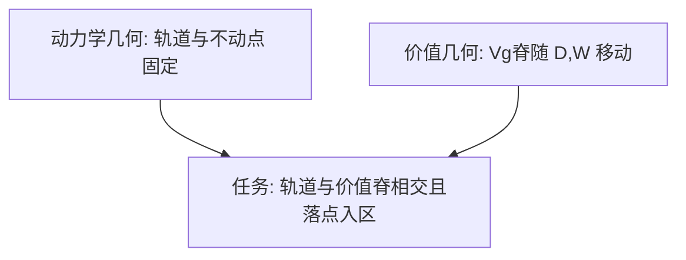

# Cut-to-Box 任务：实验设计（地面目标区域）

## 摘要

本研究采用 **Cut-to-Box（切绳入区）** 行为范式，以**目标导向的释放时机**作为探针，考察被试是否持有可用于抛射决策的**内部单摆动力学模型**。单摆以固定振幅摆动；被试在某个时刻按下切断键，摆球脱离摆线作抛射运动，目标为使摆球着陆点落在地面上的**目标区域**内。被试的唯一控制维度是**何时切断**——一维决策。该任务具有诊断性：释放态 $(\theta, \omega)$ 经抛射切换映射至着陆点，该映射对释放相位**非单调**（「越晚切断 = 落点越远」在部分区间不成立）；仅追踪屏幕位置的策略无法解题，而表征完整状态与切向发射速度的策略可以。移动目标区域会使价值最大化的释放相位在相平面上扫过，从而将**固定的动力学几何**（摆的轨道与不动点）与**目标依赖的价值几何**（何处切断能使落点落入该区域）分离开来。本文档规定刺激、实验条件、行为读数及可区分候选策略的定性签名

---

## 1 研究问题与假设

### 1.1 研究动机

被动预测（「摆球将在何处？」）**欠定**内部模型：多种近似在短时推演上可能一致。而**朝向目标行动**迫使被试作出承诺：必须将所持有的摆模型转化为单一运动决策，且该决策的收益可评分。

Cut-to-Box 是将上述逻辑最简化的任务之一：

- **行动一维**：整个决策是摆动弧线上的一个点（释放时刻）；
- **收益可解析**：切断后飞行为标准抛射，最优释放可计算，误差可解释；
- **映射非单调且目标依赖**：简单启发式会产生**可证伪的、可区分**的错误模式。

### 1.2 核心研究问题

被试选择切断时机时，是依据**内部摆模型**对切断后抛射结果进行**价值评估**，还是采用**忽略发射速度几何**的位置/时间启发式？

## 2 被试

### 2.2 试次量（试点设计）

试点方案交叉约 **6 个目标区域中心位置** × **25 个振幅水平**

---

## 3 实验装置

### 3.1 硬件环境

- 彩色显示器（呈现摆、地面目标区域及反馈）；
- 输入设备：用于**按住并松开切断键**的响应器（具体键位见 §10 待补充）；
- 建议安静环境，减少非视觉干扰。

### 3.2 任务场景（刺激级描述）

- 长度为 $L$ 的单摆悬挂于高度 $H$ 处的枢轴；
- 摆球以**固定振幅**摆动；
- 地面上以水平距离 $D$ 为中心、宽度为 $W$ 的**目标区域**标示落点容许范围；
- 被试按下**切断键**；按下瞬间切断摆线，摆球沿抛射轨迹运动；
- **飞行不遮挡**：切断后摆球运动轨迹可见, 并且按照已经前进的实时生成过去的轨迹
- **反馈**：着陆点是否落在目标区域内，以及着陆点位置。

> **说明**：实验程序实现待开发；本节仅规定任务级呈现与操作需求。

---

## 4 刺激与物理模型

### 4.1 坐标与释放态

枢轴位于 $(0, H)$；$\theta$ 自竖直向下量起。切断瞬间摆球沿弧线切向速度 $v = \omega L$，释放态 $(\theta, \omega)$ 确定发射位置与速度：

$$
x_0 = L \sin\theta, \quad y_0 = H - L \cos\theta
$$

$$
v_x = \omega L \cos\theta, \quad v_y = \omega L \sin\theta \tag{1}
$$

### 4.2 抛射与着陆

切断后摆球作抛射运动。取下降至地面高度 $y_g$ 的 descending root，着陆时刻与水平位置为：

$$
t_\mathrm{land} = \frac{v_y + \sqrt{v_y^2 + 2g(y_0 - y_g)}}{g}
$$

$$
x_\mathrm{land} = x_0 + v_x \, t_\mathrm{land} \tag{2}
$$

### 4.3 目标区域与成功判定

地面目标区域以水平区间定义：中心位置 $D$、宽度 $W$，着陆面高度为 $y_g$。试次成功当且仅当

$$
x_\mathrm{land} \in \left[D - \frac{W}{2},\, D + \frac{W}{2}\right].
$$

**有符号着陆误差**（相对区域中心）可写为 $\Delta x = x_\mathrm{land} - D$；**过射 / 欠射**即 $\Delta x > 0$ / $\Delta x < 0$。是否命中目标区域为二值因变量；$\Delta x$ 为连续误差读数。

### 4.4 价值几何与诊断性（相对 Proposal 7 图示）

在固定摆动上，$x_\mathrm{land}$ 对释放相位**非单调**（示例：$L=1\,\mathrm{m}$，$H=2.2\,\mathrm{m}$，振幅 $85°$ 时最大射程约 $3.07\,\mathrm{m}$，峰值不在最低点而在 $\theta \approx 31°$）。中程目标区域可由**两个不同释放相位**命中，且对应价值脊宽度不同。

- **动力学几何**（不随目标改变）：不动点、闭合轨道与 separatrix；
- **价值几何**（随目标改变）：使 $x_\mathrm{land}$ 落入目标区域的释放态集合，即 $V_g(\theta, \omega)$ 的脊，随 $D$（及 $W$）移动。

当 $D$ 从 $0.8\,\mathrm{m}$ 增至 $2.4\,\mathrm{m}$ 时，最优释放相位示例从 $\theta^\star \approx -28°$ 移至 $\theta^\star \approx +55°$。解题即求**当前轨道**与**当前目标区域对应的价值脊**的交点。

---

### 5.1 单试次流程

文字描述：

1. **观察**：观看摆动 **1–2 个周期，目标区域一直可见**；
2. **目标线索**：地面目标区域标示其中心位置 $D$ 与宽度 $W$；
3. **切断**：被试在自选时刻按下切断键；
4. **飞行不遮挡**：切断后摆球轨迹可见；
5. **反馈**：呈现着陆点是否落在目标区域内，及着陆点位置。

### 5.3 可达性与自然扩展（pump-then-release）

当目标区域超出**当前轨道**的最大可达射程时，正确行为不是立即切断，而是**先泵摆增大轨道、再释放**（pump-then-release）。该变体将轨道动力学、能量注入、释放切换与目标串联于单一任务；Proposal 7 在此仅作标注，模型化发展见 Proposal 8。是否纳入首版实验见 §10。

---

## 6 因变量与行为读数

### 6.1 主要读数

| 读数                     | 说明                                                                      |
| ------------------------ | ------------------------------------------------------------------------- |
| **释放相位分布**   | 各条件下切断时刻对应的释放相位（$\theta$、$\omega$ 或等价表征）的分布 |
| **有符号着陆误差** | 相对目标区域中心：$\Delta x = x_\mathrm{land} - D$；作为 $D$ 的函数区分过射 vs 欠射 |
| **命中率 / 成功率** | $x_\mathrm{land} \in [D - W/2,\, D + W/2]$ 的试次比例 |
| **决策时间**       | 从试次相关起点至切断的时刻（起止定义见 §10）                             |
| **试间变异**       | 在重复出现的相同状态下的试次间变异                                        |
| **声明不可达率**   | 小振幅条件下被试声明目标不可达（或等效行为）的比例                        |

### 6.2 分析单元

以**试次级**记录释放态、$x_\mathrm{land}$、是否命中目标区域、$\Delta x$ 与条件标签（$D$、$W$、振幅）；重复试次用于估计条件内分布与变异。具体字段与导出格式见 §10。

---

## 7 预测性行为签名

### 7.1 三策略对比

| 情境                     | 完整内部模型                                               | 「越晚 = 越远」启发式                                                                          | 固定小角模型                     |
| ------------------------ | ---------------------------------------------------------- | ---------------------------------------------------------------------------------------------- | -------------------------------- |
| $D$ 增大（含非单调区） | 释放相位按解析最优**非单调**追踪 $\theta^\star(D)$ | 释放相位**单调**随 $D$ 增大；越过 $\theta \approx 31°$ 射程峰后**系统性过射** | 大振幅下切向速度低估 → 着陆偏短 |
| 双解中程目标区域         | 偏好**更宽**价值脊（时机更稳健）的释放相位           | 不区分双解，倾向单一单调策略                                                                   | 两解均可能偏短                   |
| 小振幅 + 远$D$         | 可声明不可达或采取 pump-then-release（若任务允许）         | 仍可能按单调启发式切断 → 失败模式可辨                                                         | 误差随振幅增大                   |
| 飞行可见（主条件）       | 可凭轨迹在线修正；表现仍反映释放时机选择质量               | 主要依赖观察阶段位置/时间线索                                      | 误差随振幅增大                   |

### 7.2 操纵的差异化预测

- **降低证据**（缩短观察、降低对比度）：释放分布变宽，向振幅平均猜测收缩；
- **目标区域宽度 $W$**：$W$ 增大提高命中率基线，但释放相位最优值一般不变；价值脊在相平面上变宽，时机容错增大；
- **移动 $D$**：价值脊在相平面上平移，最优释放相位呈非单调偏移（见 §4.4）。

---

## 8 试点与验证计划

### 8.1 采样策略

试点先在 $D$ 与释放相位的**粗网格**上采样，定位候选策略分歧最大的区域——**远目标区域 + 大振幅**角落（非单调性最显著处），再在该区域**加密**采样。

### 8.2 运行前健全性检查（Sanity checks）

正式采集前须确认：

1. **渲染抛射**服从 Eq. (2)（数值与解析一致）；
2. **解析最优释放曲线**（类比 Figure 2a）可由刺激引擎复现；
3. 至少存在**一档**目标区域中心位置，其可达解要求释放相位**越过射程峰**（$\theta \approx 31°$），使启发式与完整模型**必然分歧**。

### 8.3 建议试点设计摘要

| 项目          | 取值                        |
| ------------- | --------------------------- |
| 目标区域中心 $D$ | $\sim 6$ 水平             |
| 目标区域宽度 $W$ | **待锁定**                  |
| 振幅          | 25 水平（见 §2.2）          |
| 飞行呈现      | 不遮挡（轨迹全程可见）      |
| 重复次数      | **待锁定** / 单元胞        |
| 试次/人       | $6 \times 25 \times$ 重复次数 |
| 被试数        | $n \approx 20\text{--}30$ |

---

## 9 实验伦理与注意事项

- 实验前说明任务要求、预估时长及可随时退出；
- **无欺骗**：反馈如实呈现 $x_\mathrm{land}$ 与是否落在 $[D - W/2,\, D + W/2]$ 内；
- **飞行不遮挡**（本稿主条件）：切断后轨迹可见，被试可观察抛射结果；决策质量仍主要由切断时刻决定；
- 可选重标定块若实施，须事先告知参数可能变化。

---

## 10 待补充细节

以下条目在 Proposal 7 中**未固定**，须在实验实施前逐项锁定。括号内为当前状态。

### 10.1 几何与物理常数

1. 正式实验摆长 $L$、枢轴高度 $H$、重力加速度 $g$（图示示例 $L=1\,\mathrm{m}$、$H=2.2\,\mathrm{m}$ 是否即为正式值）——**待锁定**
2. 地面高度 $y_g$（着陆面；通常 $y_g = 0$）——**待锁定**
3. 目标区域水平宽度 $W$ 及命中判定容差（几何落入 vs 视觉命中）——**待锁定**
4. 目标区域在画面上的视觉呈现方式（如地面色带、边框；是否等同于 $[D - W/2,\, D + W/2]$）——**待锁定**
5. 约 6 档目标区域中心位置 $D$ 的**具体数值**（Proposal 7 仅给出范围约 $0.8\text{--}2.4\,\mathrm{m}$ 及近→远结构）——**待锁定**
6. 小振幅 vs 大振幅的**具体角度或能量**定义 ——**待锁定**
7. 各振幅水平下可达最大射程的标定值 ——**待锁定**
8. 「固定振幅」的严格实现：初始条件如何设定、是否禁止被试通过切断时机注入能量 ——**待锁定**

### 10.2 试次结构与计数

9. 「1–2 个周期」观察窗：固定 1T / 2T、$[1,2]T$ 随机，或以秒计时 ——**待锁定**
10. 每单元胞重复次数（试点 $\sim 20$ 是否沿用于正式实验）——**待锁定**
11. $D$、$W$、振幅是否完全交叉、是否分 Block 呈现 ——**待锁定**
12. 条件内与条件间试次顺序的随机化规则 ——**待锁定**
13. 练习试次数与是否包含各因素的练习 ——**待锁定**
14. 指导语内容与语言 ——**待锁定**
15. 注视点、试次间间隔、Block 间休息安排 ——**待锁定**

### 10.3 操作与界面

16. 切断键具体绑定（键盘键位 / 鼠标 / 踏板）及是否要求按住后松开（vs 单次按键）——**待锁定**
17. 目标区域标示的**精确时机**（观察开始后第几秒、第几周期、或特定摆动相位；若全程可见则记为 N/A）——**待锁定**
18. 观察阶段摆球与轨道是否全程可见 ——**待锁定**
19. 目标区域出现前是否显示额外目标提示（如仅声音或文字预告）——**待锁定**
20. 飞行轨迹呈现方式：完整抛物线 vs 仅摆球质点 vs 实时尾迹 ——**待锁定**
21. 着陆反馈呈现时长 ——**待锁定**
22. 是否显示试次间连续着陆点历史 ——**待锁定**
23. **不可达**时的正式作答方式：允许不切 / 超时 / 显式「无法到达」按钮等 ——**待锁定**
24. 不可达试次的计分与纳入分析规则 ——**待锁定**
25. pump-then-release 扩展是否纳入首版实验及操作规则（是否允许多次切断前泵摆）——**待锁定**

### 10.4 因变量操作化

26. 「释放相位」主记录变量：$\theta$、$\omega$、时间 $t$、或相位 $\phi$ ——**待锁定**
27. 释放态采样时间精度与坐标系约定（$\theta$ 零方向与正负）——**待锁定**
28. 有符号着陆误差零点：相对区域中心 vs 区域近缘 ——**待锁定**
29. 命中成功判定规则：$x_\mathrm{land} \in [D - W/2,\, D + W/2]$（几何完全落入 vs 部分重叠）——**待锁定**
30. 「决策时间」起止事件：试次开始 → 切断，或目标区域标示出现 → 切断 ——**待锁定**
31. 「重复态」操作定义：相同 $D$、$W$、振幅的试次组如何标识 ——**待锁定**

### 10.5 试点与质控

32. Pilot 粗网格中 $D$ 的采样点与释放相位采样密度 ——**待锁定**
33. 渲染抛射与 Eq. (2) 解析解的数值容差标准 ——**待锁定**
34. 决策时间 / 释放相位离群试次的剔除规则 ——**待锁定**
35. 最低成功率或出勤标准（剔除被试阈值）——**待锁定**
36. 被试编号方案 ——**待锁定**
37. 刺激集分配与 counterbalancing 方案（Proposal 7 未涉及）——**待锁定**

### 10.6 伦理与元数据

38. 预计总实验时长 ——**待锁定**
39. 被试报酬标准 ——**待锁定**
40. 知情同意书与伦理审查批件号 ——**待锁定**
41. 数据导出格式（如 CSV / JSON）及字段列表 ——**待锁定**

---

## 11 可重复性清单（Proposal 7 已规定部分）

| 项目         | 说明                                                                                              |
| ------------ | ------------------------------------------------------------------------------------------------- |
| 范式名称     | Cut-to-Box（切绳入区；地面目标区域）                                                              |
| 成功判定     | $x_\mathrm{land} \in [D - W/2,\, D + W/2]$                                                      |
| 核心控制维度 | 切断时机（一维）                                                                                  |
| 主条件       | 飞行不遮挡；目标区域全程可见                                                                      |
| 物理映射     | Eq. (1) 释放态 → Eq. (2) 着陆 → 与区间 $[D \pm W/2]$ 比较                                      |
| 诊断特征     | 着陆–释放相位非单调；价值脊随 $D$（及 $W$）移动                                                  |
| 数值示例     | $L=1\,\mathrm{m}$, $H=2.2\,\mathrm{m}$, 振幅 $85°$；$D$: $0.8\text{--}2.4\,\mathrm{m}$ |
| 试点规模     | $6 \times 25 \times$ 重复次数/人；$n \approx 20\text{--}30$                                     |
| 形式化模型   | Proposal 8（价值模型与策略拟合）                                                                  |
| 文献定位     | Proposal 9                                                                                        |

---

## 参考文献

- **Proposal 7**：*The Cut-to-Box task: goal-directed release timing as a probe of internal pendulum dynamics*（2026-06-08）——本稿将原「入箱」目标改为**地面目标区域** $[D \pm W/2]$ 命中判定，其余诊断逻辑同 Proposal 7。
- **Proposal 8**（配套）：将 §7 行为签名形式化为可拟合的价值模型（本文档不展开）。
- **Proposal 9**（配套）：任务在直觉物理与运动认知文献中的定位（本文档不展开）。
